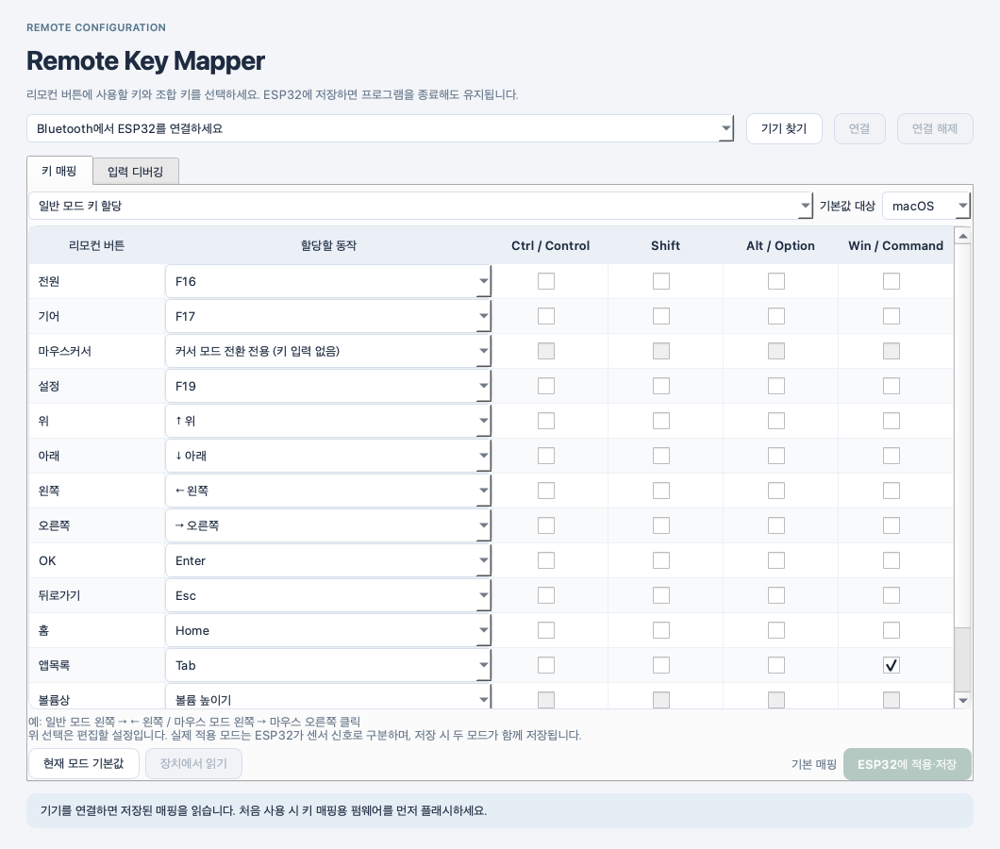

[한국어](README.md) | [English](README.en.md)

# Great Portable Monitor Remote

**Use a Great Portable Monitor remote as a keyboard and mouse on macOS or Windows.**

An ESP32 receives BLE remote input and forwards standard Bluetooth HID keyboard, mouse and volume reports to your computer. **Remote Key Mapper** edits separate normal-mode and cursor-mode button mappings and saves them to the ESP32. Saved mappings keep working after the app closes.

```text
Remote ── BLE ── ESP32 ── BLE HID ── macOS / Windows
                   ↑                     │
                   └── saved mappings ───┘
```

## Downloads

Download your platform ZIP from the [latest release](https://github.com/alphaorderly/Great-Portable-Monitor-Remote/releases/latest) and extract the entire archive. No separate Python installation is required.

| Platform in filename | Target | Launch |
|---|---|---|
| `macos-arm64` | Apple Silicon, macOS 13+ | `RemoteKeyMapper.app` |
| `macos-x86_64` | Intel Mac, macOS 13+ | `RemoteKeyMapper.app` |
| `windows-arm64` | Windows 11 ARM64 | `RemoteKeyMapper/RemoteKeyMapper.exe` |
| `windows-x86_64` | Windows 11 Intel/AMD 64-bit | `RemoteKeyMapper/RemoteKeyMapper.exe` |
| `firmware-esp32` | Shared ESP32 firmware | Flash binaries and address metadata |

Here, x86 means **x86_64**. This release does not target 32-bit Windows or other ESP32 chip families such as S2/S3/C3. Apps are not Developer ID notarized or Authenticode signed, so the OS may display a security check. Compare downloaded files against `SHA256SUMS.txt` in the release.

## Getting started

1. Install the [firmware](docs/FIRMWARE.md) on an ESP32 and turn on the remote. See that guide for first pairing.
2. Pair **ESP32 Remote Bridge** in your computer's Bluetooth settings.
3. Launch the app and choose **기기 찾기 → 연결** (Find devices → Connect). The app reads the device's current mappings.
4. Choose **일반 모드 / 마우스 커서 모드** (Normal / Cursor mode) and edit button actions.
5. Choose **ESP32에 적용·저장** (Apply and save). Success is shown only after a readback matches the requested settings.

All platforms show **Ctrl / Control, Shift, Alt / Option, Win / Command** together. Control and Command are distinct HID keys: use Ctrl+C for copy on Windows or Command+C on macOS.

Select the OS under **기본값 대상** (Preset target) and click **현재 모드 기본값** (Current mode defaults). The app-list button uses Command+Tab for macOS and Alt+Tab for Windows/Linux. Existing device mappings are never converted automatically. For initial Windows setup, load defaults for both modes and save. Firmware factory defaults retain Command+Tab for compatibility with existing devices.



This is an actual Qt screenshot with no device connected. The app UI is Korean; repository documentation is available in Korean and English.

## Support and validation

- Arrows, letters, digits, symbols, F1–F24, navigation keys, volume, three mouse buttons and keyboard modifiers.
- Independent normal/cursor mappings; the cursor button is reserved for mode switching.
- The GUI opens only the dedicated vendor HID collection and never captures global keyboard input. macOS uses shared device access.
- Windows reserves keyboard/mouse collections for the OS. Original remote input can be logged; native output reports may not reach the GUI connection.
- CI tests Python/Qt, builds and extracts all four app packages, runs packaged smoke checks, and compiles ESP-IDF firmware with native C regressions. **Real Windows BLE pairing, configuration persistence and sleep/resume remain unverified on hardware.** See the [compatibility review](docs/WINDOWS_COMPATIBILITY.md) for evidence and the hardware test procedure.

## Running from source

Use Python 3.12 from the repository root.

macOS:

```sh
python3 -m venv .venv-gui
.venv-gui/bin/python -m pip install -r python/requirements.txt
.venv-gui/bin/python python/run_keymapper.py
```

Windows PowerShell:

```powershell
py -3.12 -m venv .venv-gui
.venv-gui\Scripts\python.exe -m pip install -r python/requirements.txt
.venv-gui\Scripts\python.exe python/run_keymapper.py
```

On Windows ARM64, use native ARM64 Python. `hidapi==0.15.0` has no ARM64 wheel, so source installation requires Visual Studio C++ ARM64 build tools. CI compiles it with those tools. End users can simply use the packaged ZIP. The source also accounts for Linux, but no Linux binary release is provided.

## Development and releases

```sh
# Use your virtualenv Python (Scripts/python.exe on Windows)
.venv-gui/bin/python -m unittest discover -s python/tests -v
.venv-gui/bin/python python/run_keymapper.py --self-test
# In an activated ESP-IDF 5.5.5 terminal
python firmware/scripts/build.py -B build build
# C sanitizer tests: macOS/Linux/WSL, cc and the patched ESP-IDF SDK
python firmware/tests/native/run_tests.py --idf-path /path/to/esp-idf
```

Pushes to `main` and pull requests run builds and tests. Pushing a `v*` tag repeats validation, then automatically publishes a GitHub Release containing four apps, ESP32 firmware and SHA-256 checksums. Publication requires all builds to pass. See [release tooling](docs/RELEASING.md).

| Directory | Contents |
|---|---|
| `python/` | Qt GUI, HID configuration protocol, tests |
| `firmware/` | ESP-IDF source, NimBLE patch, C tests |
| `shared/fixtures/` | Shared Python/C protocol fixtures |
| `scripts/`, `.github/workflows/` | Packaging, checks and automated releases |
| `docs/` | Current usage, compatibility and release guides |

[Python guide](python/README.md) · [Firmware](docs/FIRMWARE.md) · [Windows review](docs/WINDOWS_COMPATIBILITY.md)

Historical pairing/capture notes remain local and are excluded from the public repository and app archives. Local SDKs, virtual environments, build outputs and raw Bluetooth logs are also excluded from Git.
