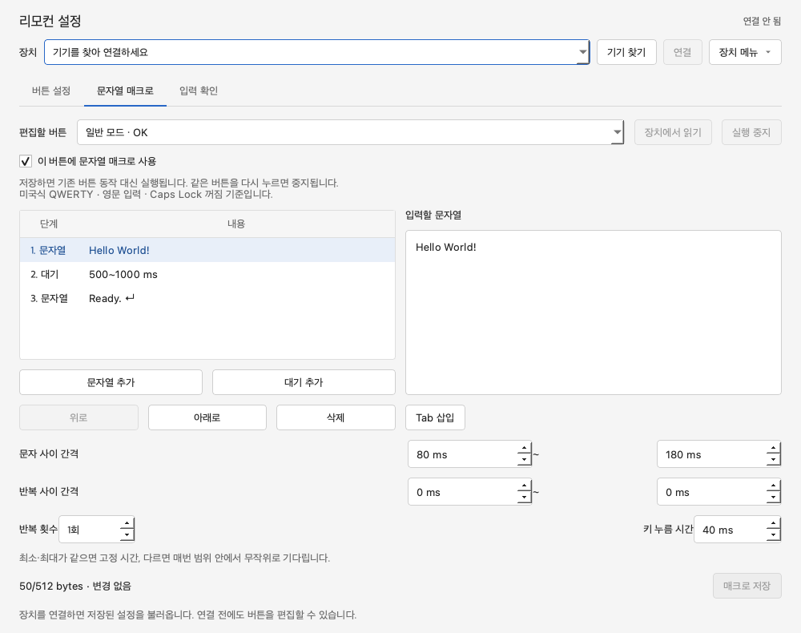

[한국어](../README.md) | [English](../README.en.md)

# Remote Key Mapper

ESP32-S3에 연결된 리모컨의 버튼 동작을 설정하는 macOS·Windows 앱입니다. 설치 방법은 [프로젝트 README](../README.md)를 참고하세요.

장치 목록은 전용 설정용 HID만 표시합니다. 새 장치는 `USB Keyboard & Mouse · USB`, 기존 장치는 `ESP32-S3 Remote Bridge · USB`로 표시됩니다. S3는 USB/OTG 포트에 연결하며, 같은 앱에서 입력 디버깅과 설정 읽기·저장을 사용합니다. 일반 키보드·마우스 collection은 열지 않습니다. USB 재연결도 일련번호로 원래 기기를 확인하며, 저장 명령은 자동 반복하지 않습니다.

## 실행과 매핑

```sh
python python/run_keymapper.py
python python/run_keymapper.py --debug
python python/run_keymapper.py --list
python python/run_keymapper.py --diagnostics hid-diagnostics.json
python python/run_keymapper.py --self-test
python python/run_keymapper.py --screenshot preview.png
```

Python 3.12에 `python/requirements.txt`의 의존성을 설치한 뒤 저장소 루트에서 실행하세요. macOS용 `run_keymapper.zsh`와 Windows용 `run_keymapper.cmd`로 실행하면 루트의 `.venv-gui`를 사용합니다. `--self-test`와 `--screenshot`은 장치를 연결하지 않고 사용할 수 있습니다.

1. **기기 찾기 → 연결**: ESP32-S3의 현재 매핑을 읽습니다. 연결 시 설정 형식을 검증한 후 저장을 활성화합니다.
2. **버튼 설정 → 일반 모드 / 마우스 모드**: 왼쪽 목록에서 버튼을 선택하고 오른쪽에서 동작과 조합 키를 편집합니다. 다른 모드로 이동해도 편집 내용은 유지됩니다.
3. **설정 메뉴 → 운영체제 선택 → 기본값 불러오기**: 선택한 OS의 기본값을 현재 편집 모드에 불러옵니다. 앱목록은 macOS Command+Tab, Windows/Linux Alt+Tab입니다. OS 선택만으로 기존 매핑을 바꾸지는 않습니다.
4. **장치에 저장**: 두 모드를 함께 저장하고, 장치에서 다시 읽어 저장 결과를 확인합니다.

- **설정 메뉴 → 장치에서 읽기**는 편집 내용을 장치의 설정으로 바꿉니다. 연결 전에 수정한 내용은 최초 연결 시 유지합니다.
- 저장 중 오류가 나면 **장치에서 읽기**로 저장 상태를 확인한 뒤 다시 편집하세요.
- 방향키, Enter/Esc/Tab/Space, 영문·숫자·기호, F1~F24, 탐색 키, 볼륨과 마우스 좌/우/가운데 클릭을 지원합니다.
- 조합 키는 Ctrl/Control, Shift, Alt/Option, Win/Command를 선택할 수 있습니다. Command와 Control은 별개의 키이므로 사용하는 OS에 맞게 지정하세요.
- 실제 문자는 호스트 키보드 배열과 입력기에 따라 달라집니다. 클릭과 볼륨에는 조합 키를 붙이지 않습니다.
- 일반 모드 기본값은 방향키→방향키, OK→Enter입니다. 마우스 모드는 왼쪽→우클릭, OK→좌클릭입니다.
- 커서 버튼은 모드 전환 전용으로 키 입력을 보내지 않습니다.
- 마우스 커서 모드의 **마우스 속도** 슬라이더는 0.25~3배를 0.25배 단위로 조절합니다. 기본값은 1배이며, 휠 속도에는 영향을 주지 않습니다. **장치에 저장**하면 두 모드의 매핑과 함께 저장됩니다.
- 마우스 모드의 홈 버튼은 할당할 수 없습니다. 누르는 동안 커서를 고정하고 이동량을 버려 손 위치를 조정할 수 있습니다. 버튼을 놓으면 그 자리에서 다시 조작합니다. 일반 모드의 홈 버튼은 기존대로 설정할 수 있습니다.
- **기본값 불러오기**은 마우스 모드에서만 속도도 1배로 되돌립니다.


## 모드 전환과 설정 저장

앱에서 모드를 선택하면 해당 모드의 버튼 설정을 편집할 수 있습니다. 사용 중 모드 전환은 리모컨의 센서 신호에 따라 ESP32-S3가 처리합니다.

- ID 91의 센서 START는 마우스 모드를 나타냅니다. 커서 단독 버튼 뒤의 STOP은 일반 모드로 전환합니다.
- 방향키 사용 중 STOP→방향키→START→방향키+6A 순서는 일시 정지로 처리합니다.
- 모드 전환 시 기존 키·클릭을 해제합니다. 재연결 후 모드를 모르면 일반 모드에서 시작합니다.
- v1 설정을 불러오면 두 모드에 복사하며, 마우스 모드의 OK 버튼은 좌클릭으로 유지합니다.
- v1/v2 설정은 속도 1배로 불러오며, 마우스 모드의 홈 버튼은 일시 정지 전용으로 바뀝니다. 일반 모드의 홈 버튼과 나머지 기존 할당은 유지합니다.
- 새 설정은 `remote_keymap/map_v3`에 저장하고 `map_v1`, `map_v2`는 남깁니다. 구형 GUI는 v3 설정을 덮어쓰지 못합니다. 새 GUI를 사용하려면 펌웨어도 함께 업데이트하세요.

## 입력 디버깅

**입력 확인 → 입력 기록**을 켜거나 `--debug`로 시작하세요. 리모컨의 실제 모드를 맞춘 뒤 **테스트할 모드**를 선택합니다. 이 선택은 기록 분류용이며 ESP32-S3의 실제 모드를 변경하지 않습니다.

- **리모컨 원본**은 설정한 동작으로 변환하기 전의 버튼 입력입니다.
- **호스트 키보드 / 마우스 / 볼륨**에는 앱이 수신한 출력 보고서를 기록합니다. Windows에서는 이 기록이 보이지 않을 수 있으므로, 입력이 동작하는지는 메모장 등의 앱에서 확인하세요.
- 전역 입력을 가로채거나 OS가 독점한 키보드·마우스를 열지 않습니다. 실제 입력은 기록 중에도 계속 동작합니다.
- 기록을 시작할 때 이미 눌려 있던 입력은 상태 복구로 표시합니다. 비교 횟수에는 버튼 누름과 초기 상태만 포함합니다.
- 최근 입력을 기본으로 보여주며, **모드별 집계 표시**와 **원시 HID 표시**를 켜면 상세 정보를 볼 수 있습니다.
- 기록은 최대 300줄, 마우스 이동은 초당 최대 10회입니다. 누락·해석 제외 수를 별도로 표시합니다.


## HID 설정 통신

설정 통신에는 전용 Vendor HID 컬렉션 `FF00 / Usage 1`을 사용합니다. macOS에서는 HIDAPI의 공유 접근을 활성화합니다. 모든 HID I/O는 하나의 작업 스레드에서 처리합니다.

Feature Report ID 5의 payload는 64 bytes입니다. GATT에서는 ID를 제외한 64 bytes, HIDAPI에서는 ID 포함 65 bytes를 사용합니다. 읽기에서는 backend가 ID를 생략한 64 bytes도 허용합니다.

| Payload | 의미 |
|---|---|
| 0–3 | `4B 4D 03 0E`: KM, v3, 버튼 14개 |
| 4–5 | revision, little-endian 16-bit |
| 6 | 모드 수 2 |
| 7 | 마우스 속도 1~12: 값 × 0.25배, 기본 4(1배) |
| 8–35 | 일반 모드 14개 × 16-bit |
| 36–63 | 마우스 모드 14개 × 16-bit |

각 항목은 bit 0–6=키, 7–8=종류, 9–12=조합 키, 13–15=예약 0입니다. 종류는 없음=0, 키보드=1, 볼륨=2, 마우스=3이며, 조합 키는 Control=1, Shift=2, Alt=4, Win/Command=8입니다. ESP32-S3는 USB 연결 상태, 데이터 길이, 지원 값과 revision을 확인하고, 전체 설정을 NVS에 저장한 뒤 적용합니다.

커서 버튼은 두 모드에서, 홈 버튼은 마우스 모드에서 항목 값이 0이어야 합니다. 펌웨어는 다른 할당을 거부합니다.

## 테스트

```sh
python -m unittest discover -s python/tests -v
python python/run_keymapper.py --self-test
```

프로젝트 루트에서 실행합니다. 장치 연결 없이 통신 프로토콜, 저장 결과 확인, 두 모드 편집, 조합 키, Windows 기본값, OS별 API 호출을 검사합니다. 펌웨어 테스트와 Windows 실기 확인 항목은 [Windows 호환성 검토](../docs/WINDOWS_COMPATIBILITY.md)를 참고하세요.

## 연결 상태와 자동 재연결

앱의 연결 상태는 **연결 중 → 설정 읽는 중 → 사용 가능** 순서입니다. **기기 찾기**는 USB HID 장치를 검색합니다. **연결 해제**는 앱의 HID 접근과 자동 재시도만 종료합니다. PC 전환 시 USB/OTG 케이블을 옮기세요.

사용자가 선택한 기기에서 통신 오류가 나면 1, 2, 4, 8초 뒤에 재시도하고 이후에는 10초 간격으로 반복합니다. 재연결 중에도 편집 내용은 유지되며 **연결 해제**로 재시도를 취소할 수 있습니다. 입력이 없다는 이유만으로 재연결하지 않습니다.

동일한 HID 경로를 우선 사용하며, 경로가 바뀌면 유효하고 유일한 일련번호로 동일 기기를 확인합니다. 동일 기기인지 확인할 수 없거나 중복된 식별 정보가 있으면 재시도를 멈추고 기기를 다시 선택하도록 안내합니다. 설정 형식이 호환되지 않으면 앱·펌웨어 버전을 확인하세요.

저장 도중 통신이 끊겨도 저장 명령을 자동으로 다시 보내지 않습니다. 재연결 후 장치 설정을 읽어 요청한 설정·revision과 비교합니다. 일치하면 장치에서 요청한 설정을 확인했다는 메시지를, 다르면 자동으로 다시 저장하지 않았다는 메시지를 표시합니다. 화면의 편집 내용과 실제 장치 상태를 확인한 뒤 명시적으로 저장하세요.

소스 실행 시 검색·연결·초기 읽기·재연결 상태는 표준 Python 로그에도 기록됩니다. 장기간 반복되는 재시도 로그는 DEBUG 수준으로 줄이며, HID 경로나 페어링 키를 진단 메시지에 출력하지 않습니다.

## Windows 기기 검색과 진단 저장

검색은 장치를 열지 않고 HIDAPI 메타데이터만 사용합니다. 새 제품명과 제조사가 일치하거나 기존 ESP32-S3 제품명을 사용하는 FF00/1 collection을 표시하며 Bluetooth 장치와 일반 키보드·마우스는 제외합니다. 연결 시 Feature ID 5를 읽어 설정 형식을 검증합니다.

**장치 메뉴 → 검색 진단 저장**은 마지막으로 완료된 검색 결과를 JSON으로 저장합니다. 재연결을 위한 검색도 마지막 결과에 반영됩니다. 후보 없음, 기기 발견, 검색 오류를 별도로 안내합니다. USB가 연결됐어도 HIDAPI에서 누락될 수 있으므로 빈 결과를 미연결로 단정하지 않습니다.

배포 exe는 Python 설치 없이 다음과 같이 진단 파일을 만들 수도 있습니다. 실행 파일이 있는 폴더에서 실행하세요.

```powershell
.\RemoteKeyMapper.exe --diagnostics .\hid-diagnostics.json
```

이 옵션은 GUI와 작업 스레드를 시작하지 않습니다. 종료 코드는 검색 완료(후보 0개 포함) `0`, 검색 오류를 파일에 기록한 경우 `1`, 파일 저장 실패 `2`입니다. `--list`, `--self-test`, `--screenshot`과 동시에 사용할 수 없습니다. 창 모드 exe에서는 `--list`의 표준 출력이 보이지 않을 수 있으므로 진단 파일을 사용하세요.

JSON에는 앱 빌드 식별자(커밋과 소스 해시), OS·CPU·Python·HID 패키지·내장 HIDAPI 버전, 검색 시각, 필터 전 메타데이터, 분류·표시 여부·제외 이유와 검색 오류가 포함됩니다. 바이트 경로는 읽기용 문자열과 복원 가능한 16진수로 저장합니다. 설정 보고서·입력 이벤트·페어링 키는 수집하지 않습니다.

원본 목록에 장치가 있으면 분류와 제외 이유를 확인할 수 있습니다. Windows 장치 목록에는 있지만 진단의 원본 목록에 없다면 HIDAPI 자체 누락 조사 대상입니다.

## 문자열 매크로

새 펌웨어는 USB 제품명 `USB Keyboard & Mouse`로 표시됩니다. 제조사·일련번호·설정용 HID 컬렉션을 유지하며, 앱은 기존 이름의 펌웨어도 찾을 수 있습니다. 표준 키보드·마우스 HID 입력을 사용하지만 자동 입력을 특정 프로그램에서 식별할 수 없음을 보장하는 기능은 아닙니다. 실제 장치 목록의 이름과 항목 수는 OS에 따라 달라질 수 있습니다.

**문자열 매크로** 탭에서 모드와 버튼을 선택하고 **장치에서 읽기**를 누르세요. **버튼 설정**의 **문자열 매크로 편집…**으로 해당 버튼을 바로 선택할 수도 있습니다. 새 펌웨어가 필요하며, 구형 펌웨어에서는 기존 키 설정을 계속 사용할 수 있습니다.

1. **이 버튼에 문자열 매크로 사용**을 켭니다. 저장하면 해당 모드·버튼의 기존 키 동작 대신 매크로가 실행됩니다.
2. **문자열 추가**로 영문·숫자·기본 기호를 입력합니다. 줄바꿈은 Enter, **Tab 삽입**은 Tab 입력입니다. 미국식 QWERTY, 영문 입력 상태, Caps Lock 꺼짐을 기준으로 합니다.
3. **대기 추가**로 문자열 사이에 대기 단계를 넣습니다. 단계는 위아래로 이동하거나 삭제할 수 있습니다.
4. 문자 사이 간격, 중간 대기, 반복 간격은 최소·최대가 같으면 고정, 다르면 해당 범위에서 매번 새로 선택됩니다. 문자 간격은 앞 문자의 키를 뗀 뒤 다음 키를 누르기까지입니다. 키 누름 시간은 고정값입니다.
5. **매크로 저장**은 선택한 모드·버튼 하나를 장치에 저장하고 다시 읽어 검증합니다. 버튼 설정 탭의 **장치에 저장**과 별도입니다. 앱을 종료해도 저장한 매크로는 리모컨으로 실행할 수 있습니다.



- 한 번 누르면 설정한 횟수만큼 실행합니다. 같은 버튼 또는 다른 할당 가능한 리모컨 버튼을 새로 누르면 실행을 중지하며, 중지에 사용한 버튼의 원래 동작은 보내지 않습니다. 앱의 **실행 중지**도 사용할 수 있습니다.
- 실행 중에는 이 리모컨의 일반 키·클릭·움직임 출력을 억제합니다. 컴퓨터에 별도로 연결된 다른 키보드·마우스 입력은 제어하지 않습니다.
- USB·리모컨 연결 끊김, 모드 변경, 절전, 설정 변경, 전송 오류 시 중지합니다. 재연결 후 자동으로 이어 실행하지 않으며, 버튼을 놓았다가 새로 눌러야 시작합니다.
- 키 누름 시간 10~500ms, 문자 간격 0~5,000ms, 중간·반복 대기 0~60,000ms, 반복 1~100회입니다. 실제 간격은 태스크 스케줄링과 USB 전송 지연에 따라 길어질 수 있습니다. 전송이 밀려도 누락된 시간을 따라잡기 위해 입력을 몰아서 보내지 않습니다.
- 매크로 하나는 설정과 단계 구분을 포함해 최대 512바이트입니다. 커서 전환 버튼과 마우스 모드의 홈 버튼에는 지정할 수 없습니다.
- 저장 실패 시 편집 내용을 유지합니다. **장치에서 읽기**로 확인하고 명시적으로 다시 저장하세요. 연결 전·재연결 후 처음 읽을 때는 작성 중인 내용을 유지하며 장치의 설정 버전을 확인합니다.
- 기본 키 동작으로 돌아가려면 **매크로 사용**을 끄고 **매크로 저장**을 누르세요. 기본 키 매핑 복원은 매크로를 삭제하지 않습니다.

### 매크로 설정 통신

기존 Feature Report ID 5의 64바이트 키 설정 형식을 유지합니다. 매크로는 같은 설정용 컬렉션의 Feature ID 6으로 독립 관리합니다. payload 64바이트에 `MX`, 버전 1, 명령, 슬롯, 결과, 요청 토큰, revision, offset, 총 길이, 청크 길이와 최대 48바이트 데이터를 담습니다. 슬롯은 모드×14+버튼 순서입니다.

READ / BEGIN / CHUNK / COMMIT / STOP / STATUS를 지원합니다. 업로드는 RAM에서 순서·길이·버전·문자 범위를 검사한 뒤 COMMIT에서 NVS의 `remote_macro/slotN` blob으로 저장합니다. 10초간 추가 청크가 없거나 중지·호스트 변경이 발생하면 이어서 커밋할 수 없습니다. 저장 revision이 다르거나 실행 중이면 커밋을 거부합니다. 앱은 요청 토큰과 응답을 확인하고 전체 내용을 다시 읽어 저장 결과를 검증하며, 쓰기 명령을 자동으로 반복하지 않습니다. STATUS에는 활성 매크로 슬롯과 실행 중인 슬롯만 포함됩니다. 매크로 원문을 별도 로그로 출력하지 않지만, 입력 확인을 켜면 앱에 전달되는 출력 키 코드가 기록될 수 있습니다.
