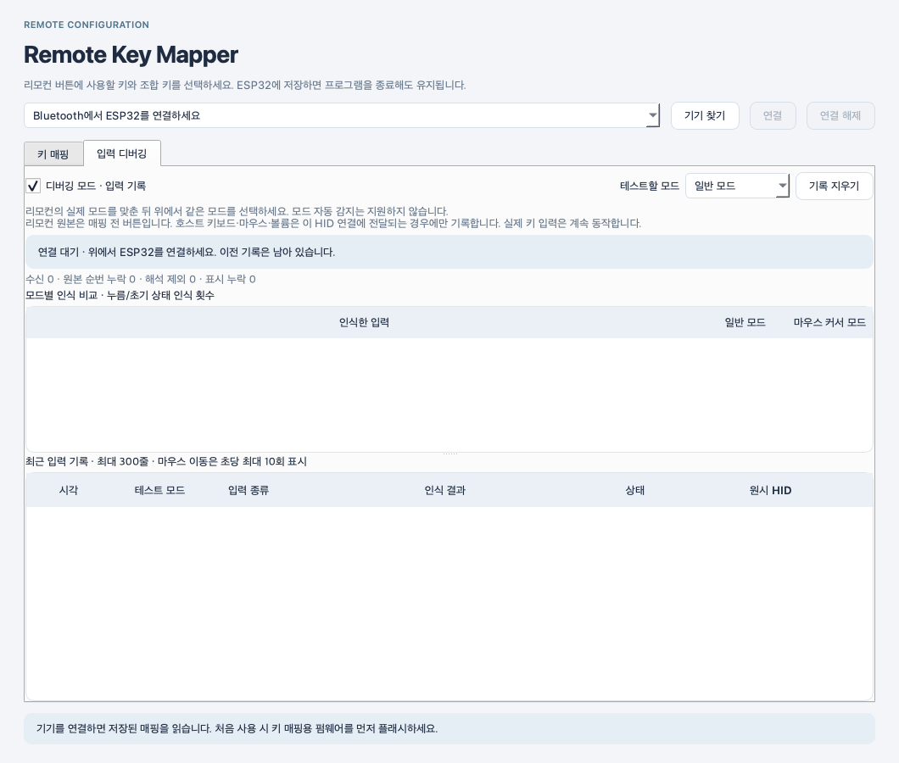

[한국어](../README.md) | [English](../README.en.md)

# Remote Key Mapper

macOS·Windows용 ESP32 리모컨 설정 프로그램입니다. 설치와 첫 실행은 [프로젝트 README](../README.md)를 참고하세요. 플랫폼 공통 실행 진입점은 `python/run_keymapper.py`입니다. Python 3.12, PySide6 6.11.2, hidapi 0.15.0을 사용합니다.

## 실행과 매핑

```sh
python python/run_keymapper.py
python python/run_keymapper.py --debug
python python/run_keymapper.py --list
python python/run_keymapper.py --self-test
python python/run_keymapper.py --screenshot preview.png
```

의존성을 설치한 Python으로 실행합니다. 기존 macOS용 `run_keymapper.zsh`와 Windows용 `run_keymapper.cmd`는 루트 `.venv-gui`를 사용합니다. `--self-test`와 `--screenshot`은 실제 HID 장치를 열지 않습니다.

1. **기기 찾기 → 연결**: ESP32의 현재 매핑을 읽습니다.
2. **일반 모드 / 마우스 커서 모드**: 편집할 프로파일을 선택합니다. 모드를 바꾸어도 다른 모드의 편집 내용은 유지됩니다.
3. **기본값 대상 → 현재 모드 기본값**: 선택한 OS의 기본값을 현재 편집 모드에 불러옵니다. 앱목록은 macOS Command+Tab, Windows/Linux Alt+Tab입니다. OS 선택만으로 기존 매핑을 바꾸지는 않습니다.
4. **ESP32에 적용·저장**: 두 모드를 함께 저장하고 다시 읽어 전체 설정과 revision이 맞는지 확인합니다.

- **장치에서 읽기**는 편집 내용을 장치의 설정으로 바꿉니다. 연결 전에 수정한 내용은 최초 연결 시 유지합니다.
- 저장 실패나 결과 불일치는 성공으로 표시하지 않습니다. 다시 읽은 후 편집하세요.
- 방향키, Enter/Esc/Tab/Space, 영문·숫자·기호, F1~F24, 탐색 키, 볼륨과 마우스 좌/우/가운데 클릭을 지원합니다.
- Ctrl/Control=1, Shift=2, Alt/Option=4, Win/Command=8입니다. 실제 HID 비트를 보내며 OS 간 Command와 Control을 자동 치환하지 않습니다.
- 실제 문자는 호스트 키보드 배열과 입력기에 따라 달라집니다. 클릭과 볼륨에는 조합 키를 붙이지 않습니다.
- 일반 모드 기본값은 방향키→방향키, OK→Enter입니다. 마우스 모드는 왼쪽→우클릭, OK→좌클릭입니다.
- 커서 버튼은 모드 전환 전용으로 키 입력을 보내지 않습니다.


## 실제 적용 모드와 저장 형식

GUI의 모드 선택은 편집 대상을 고릅니다. ESP32는 리모컨의 센서 신호로 실제 모드를 선택하므로 GUI를 종료해도 동작합니다.

- ID 91의 센서 START는 마우스 모드를 나타냅니다. 커서 단독 버튼 뒤의 STOP은 일반 모드로 전환합니다.
- 방향키 사용 중 STOP→방향키→START→방향키+6A 순서는 일시 정지로 처리합니다.
- 모드 전환 시 기존 키·클릭을 해제합니다. 재연결 후 모드를 모르면 일반 모드에서 시작합니다.
- 이전 v1 설정은 두 프로파일로 이전하며 마우스 모드 OK의 좌클릭을 유지합니다.
- 새 설정은 `remote_keymap/map_v2`에 저장하고 `map_v1`은 남깁니다. 구형 GUI는 v2 설정을 덮어쓰지 못합니다.

## 입력 디버깅

**입력 디버깅 → 디버깅 모드 · 입력 기록**을 켜거나 `--debug`로 시작하세요. 리모컨의 실제 모드를 맞춘 뒤 **테스트할 모드**를 선택합니다. 이 선택은 기록 분류용이며 ESP32의 실제 모드를 변경하지 않습니다.

- **리모컨 원본**은 매핑 전 버튼입니다. 마우스 보고서만으로 물리 버튼 이름을 추측하지 않습니다.
- **호스트 키보드 / 마우스 / 볼륨**은 선택한 HID 연결로 전달되는 경우에만 기록합니다. Windows는 별도 컬렉션을 OS가 관리하므로 이 출력 기록이 보이지 않을 수 있습니다. 그 자체가 입력 실패를 의미하지 않습니다.
- 전역 입력을 가로채거나 OS가 독점한 키보드·마우스를 열지 않습니다. 실제 입력은 기록 중에도 계속 동작합니다.
- 처음부터 눌린 입력은 상태 복구로 구분합니다. 비교 횟수는 누름·초기 상태만 포함합니다.
- 기록은 최대 300줄, 마우스 이동은 초당 최대 10회입니다. 누락·해석 제외 수를 별도로 표시합니다.



두 이미지는 미연결 렌더링이며 실제 장치 저장 성공의 증거가 아닙니다.

## HID 설정 통신

전용 Vendor collection `FF00 / Usage 1`만 엽니다. macOS에서는 HIDAPI의 공유 접근을 활성화하고, Windows/Linux에서는 Darwin API를 호출하지 않습니다. 모든 HID I/O는 단일 작업 스레드에서 수행합니다.

Feature Report ID 5의 payload는 64 bytes입니다. GATT에서는 ID를 제외한 64 bytes, HIDAPI에서는 ID 포함 65 bytes를 사용합니다. 읽기에서는 backend가 ID를 생략한 64 bytes도 허용합니다.

| Payload | 의미 |
|---|---|
| 0–3 | `4B 4D 02 0E`: KM, v2, 버튼 14개 |
| 4–5 | revision, little-endian 16-bit |
| 6–7 | 모드 수 2, 예약 0 |
| 8–35 | 일반 모드 14개 × 16-bit |
| 36–63 | 마우스 모드 14개 × 16-bit |

각 항목은 bit 0–6=키, 7–8=종류, 9–12=조합 키, 13–15=예약 0입니다. 종류는 없음=0, 키보드=1, 볼륨=2, 마우스=3입니다. ESP32는 암호화된 호스트 연결, 길이, 지원 값과 revision을 검증합니다. 전체 NVS blob 저장 성공 후 활성화합니다.

이번 리팩터링은 Report Map, GATT 순서, 저장 키를 변경하지 않습니다. C 파일의 `mac_hid` 이름과 NVS의 `mac` 키는 기존 호스트 페어링 정보를 유지하기 위한 내부 이름이며 호스트 OS 제한이 아닙니다.

## 검증

```sh
python -m unittest discover -s python/tests -v
python python/run_keymapper.py --self-test
```

프로젝트 루트에서 실행합니다. 테스트는 실제 연결 없이 프로토콜, 저장 확인, 두 모드 편집, 모든 조합 키, Windows 기본값과 Darwin 호출 격리를 검사합니다. C 테스트·ESP-IDF 빌드와 Windows 하드웨어 확인 범위는 [Windows 검토](../docs/WINDOWS_COMPATIBILITY.md)를 참고하세요.
